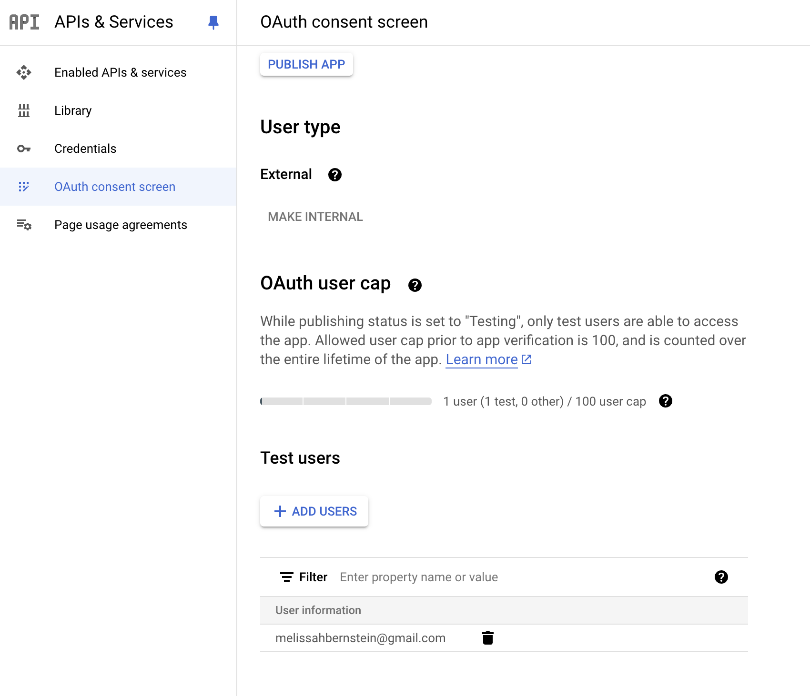

# Backing Up (my files) From Google Drive to Harddrive

## Problem

I have a lot of files on Google Drive and I'm paying $15/month for 2TB of storage, but I really only need about 200GB of space. Unfortunately, the jump for paid Google Drive is above 15 GB which is barely anything, especially when dealing with GoPro video files I have yet to look through from previous trips.

## Solution

I have used Google's Cloud Drive API to access files and folders in Google Drive before. My solution is to create an interactive Python script that copies files from any Google Drive Folder and then downloads them into your computer's (or in my case, my harddrive's) local file system.

## Features

- Google OAuth Flow/Credentials
- Terminal input
- Saves Google doc type files as PDF for easy viewing (mimeType = `application/vnd.google-apps`)

## Setup

1. In your Google Cloud Console API's page, enable `Google Drive API`. [LINK](https://console.cloud.google.com/apis/library/drive.googleapis.com)
2. Follow the button for "Add Credentials" or navigate to "APIs & Services" > "Credentials", click on "Create Credentials" and select "OAuth client ID". Follow the prompts to create your OAuth client ID. [LINK](https://console.cloud.google.com/apis/credentials)
3. Add scope "Google Drive API metadata"
4. Save this OAuth client ID in a file called `credentials.json`.

See screenshots for help setting up

5. Add your google email address as authorized test users

## Running the script

1. Install all packages `pip install -r requirements.txt`
2. Run `python script.py` or `python3 script.py`
3. Follow the Google Authentication if this is your first time. This will create a `token.pickle` file in your local folder which holds your authentication history.
4. From your google drive folder, grab the unique ID after the last `/` mark in the URL. See the video demonstration below.
5. Input that ID into the terminal
6. Input the destination folder path where you want the file to end up.
7. Repeat steps 5 and 6 for as many files you have
8. Check that the files saved to your local machine successfully! They should :)

## Video Example

<video width="320" height="240" controls>
  <source src="./ScreenRecording.mov" type="video/mp4">
  Your browser does not support the video tag.
</video>

## Tools used

1. Google Cloud Console
2. Google Cloud Documentation (e.g. [here](https://developers.google.com/drive/api/guides/manage-downloads#python))
3. Phind. Like ChatGPT but more specific for coding with more up-to-date documentation
4. VSCode.

## Future

1. download all files for a folder, not individually saving
2. batch processing? not sure how the program will manage with large video files...
